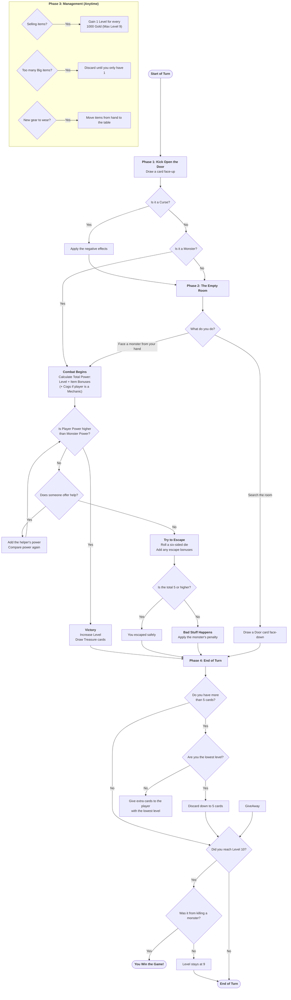
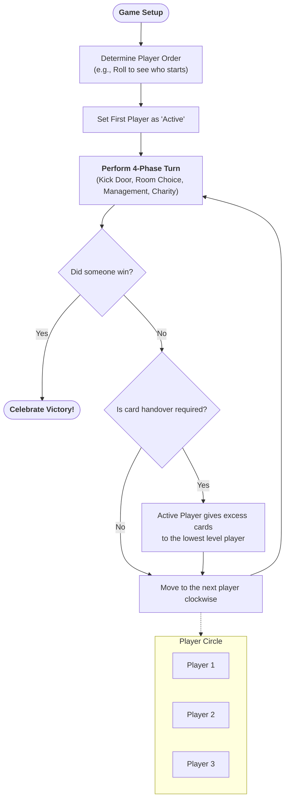

# Munchkin Steampunk: Consolidated Project Documentation

This document combines all architectural and logic artifacts for the Munchkin Steampunk implementation.

---

## 1. Project Progress (Task Tracker)

- [x] Analyze `game_plan.md` and define flowchart structure
- [x] Convert Mermaid flowchart to pseudocode style
- [x] Create self-guided implementation plan
- [x] Refine flowchart to use natural human language
- [x] Create Global Game Loop (Turn-to-Turn) flowchart
- [x] Synchronize internal artifacts with project `artifacts` folder

---

## 2. Implementation Roadmap

This plan provides a logical sequence for implementing the game based on [game_plan.md](file:///c:/Users/jacob/Munchkin/game_plan.md).

### Phase 1: State Management & Entities
- **Player State**: Tracking rank, mechanical bonuses, gear/items, and health.
- **Opponent Structure**: Enemy power levels, rewards, and "Bad Stuff" penalties.
- **Global State**: Turn management and deck maintenance.

### Phase 2: Core Combat Logic
- **Power Calculation**: Summing player bonuses vs. enemy power.
- **Resolution**: Victory rewards vs. escape sequences.
- **Escape Mechanics**: Die rolls and application of penalties.

### Phase 3: The Turn Sequence (4-Phase Cycle)
- **Phase 1 (Kick Open the Door)**: Encounter logic for curtains and monsters.
- **Phase 2 (Empty Room)**: "Looking for Trouble" or "Looting the Room."
- **Phase 4 (Cleanup)**: Charity and resource limits.

### Phase 4: Advanced Systems
- **Resource Conversion**: Gold trading for ranks.
- **Inventory Management**: Gear slots and size restrictions.

---

## 3. Visual Reference: Turn Logic Flowchart

---

## 4. Visual Reference: Global Game Cycle

