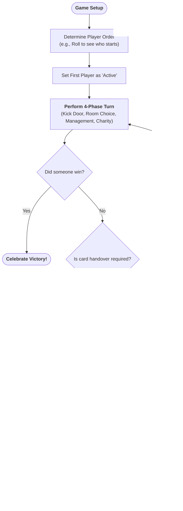

```mermaid
flowchart TD
    StartGame([<b>Game Setup</b>]) --> Order["Determine Player Order<br/>(e.g., Roll to see who starts)"]
    Order --> ActivePlayer["Set First Player as 'Active'"]
    
    ActivePlayer --> ExecuteTurn["<b>Perform 4-Phase Turn</b><br/>(Kick Door, Room Choice, Management, Charity)"]
    
    ExecuteTurn --> WinCheck{Did someone win?}
    WinCheck -- Yes --> GameOver([<b>Celebrate Victory!</b>])
    
    WinCheck -- No --> CharityHandover{Is card handover required?}
    CharityHandover -- Yes --> GiveCards["Active Player gives excess cards<br/>to the lowest level player"]
    CharityHandover -- No --> NextPlayer
    
    GiveCards --> NextPlayer["Move to the next player clockwise"]
    NextPlayer --> ExecuteTurn
    
    subgraph Players ["Player Circle"]
        P1[Player 1]
        P2[Player 2]
        P3[Player 3]
    end
    
    NextPlayer -.-> Players
```
