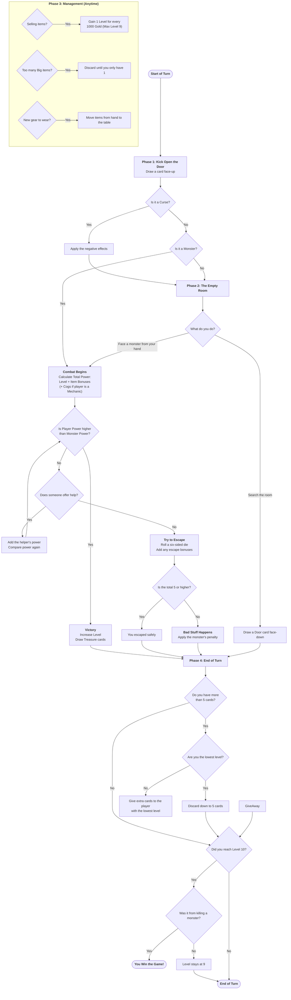

```mermaid
flowchart TD
    Start([<b>Start of Turn</b>]) --> P1["<b>Phase 1: Kick Open the Door</b><br/>Draw a card face-up"]
    
    P1 --> TypeCheck{Is it a Curse?}
    TypeCheck -- Yes --> ExecutePenalty["Apply the negative effects"]
    ExecutePenalty --> P2
    
    TypeCheck -- No --> EnemyCheck{Is it a Monster?}
    
    EnemyCheck -- Yes --> CombatFlow["<b>Combat Begins</b><br/>Calculate Total Power:<br/>Level + Item Bonuses<br/>(+ Cogs if player is a Mechanic)"]
    EnemyCheck -- No --> P2["<b>Phase 2: The Empty Room</b>"]
    
    CombatFlow --> Comp{"Is Player Power higher<br/>than Monster Power?"}
    
    Comp -- Yes --> Win["<b>Victory</b><br/>Increase Level<br/>Draw Treasure cards"]
    Win --> P4
    
    Comp -- No --> Help{"Does someone offer help?"}
    Help -- Yes --> Recalc["Add the helper's power<br/>Compare power again"]
    Recalc --> Comp
    
    Help -- No --> Run["<b>Try to Escape</b><br/>Roll a six-sided die<br/>Add any escape bonuses"]
    Run --> EscCheck{"Is the total 5 or higher?"}
    
    EscCheck -- Yes --> Success["You escaped safely"]
    Success --> P4
    
    EscCheck -- No --> Bad["<b>Bad Stuff Happens</b><br/>Apply the monster's penalty"]
    Bad --> P4
    
    P2 --> Action{What do you do?}
    Action -- "Face a monster from your hand" --> CombatFlow
    Action -- "Search the room" --> DrawSecret["Draw a Door card face-down"]
    DrawSecret --> P4
    
    P4["<b>Phase 4: End of Turn</b>"] --> HandCheck{Do you have more<br/>than 5 cards?}
    
    HandCheck -- Yes --> Charity{Are you the lowest level?}
    Charity -- Yes --> Discard["Discard down to 5 cards"]
    Charity -- No --> Transfer["Give extra cards to the player<br/>with the lowest level"]
    
    HandCheck -- No --> WinCheck
    Discard --> WinCheck
    GiveAway --> WinCheck
    
    WinCheck{"Did you reach Level 10?"}
    WinCheck -- Yes --> SourceCheck{Was it from killing a monster?}
    SourceCheck -- Yes --> GameOver([<b>You Win the Game!</b>])
    SourceCheck -- No --> Cap["Level stays at 9"]
    Cap --> EndTurn([<b>End of Turn</b>])
    
    WinCheck -- No --> EndTurn
    
    subgraph Management ["<b>Phase 3: Management (Anytime)</b>"]
        Trade{"Selling items?"} -- Yes --> RankUp["Gain 1 Level for every<br/>1000 Gold (Max Level 9)"]
        Limit{"Too many Big items?"} -- Yes --> ForceDiscard["Discard until you only have 1"]
        Slot{"New gear to wear?"} -- Yes --> Equip["Move items from hand to the table"]
    end
```
