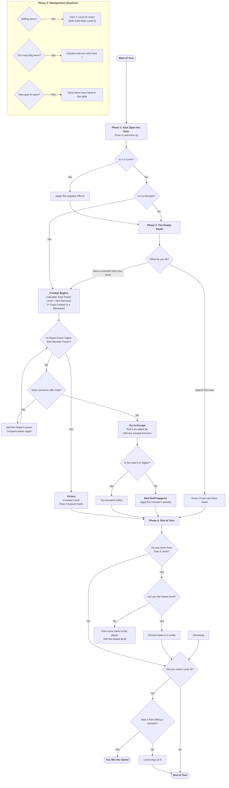
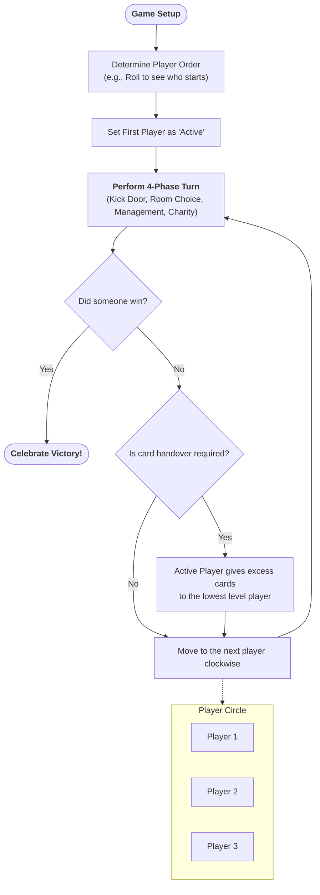

# Walkthrough: Munchkin Steampunk Logic Flowchart

I have generated a comprehensive Mermaid flowchart based on the rules defined in [game_plan.md](file:///home/jacob/Munchkin/game_plan.md).

## What Was Accomplished

- **Logic Extraction**: Analyzed the 4-phase turn structure and the combat resolution logic.
- **Flowchart Generation**: Created a Mermaid diagram that visualizes the decision tree for:
    - Kicking open the door (Curses vs. Monsters).
    - Combat Strength calculation and comparison.
    - Running Away logic (Die rolls and Escape bonuses).
    - Phase 2 choices (Looking for Trouble vs. Looting the Room).
    - Phase 4 Charity mechanics.
    - Final Win Condition check (Level 10 from Monster Kill).

## Visual Representation: Turn Logic

Below is the rendered flowchart for the Munchkin Steampunk turn logic:

## Visual Representation: Global Game Cycle

This flowchart shows how the game moves between players and the transitions "in between" each turn.

## Reference Files

- [munchkin_flow.md](file:///home/jacob/Munchkin/artifacts/munchkin_flow.md)
- [game_cycle.md](file:///home/jacob/Munchkin/artifacts/game_cycle.md)
- [implementation_plan.md](file:///home/jacob/Munchkin/artifacts/implementation_plan.md)
