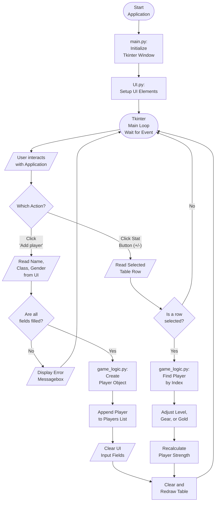

# Munchkin Scoreboard Game Flowchart

This flowchart visualizes the application's flow using standard flowchart symbols.

```mermaid
%%{init: {"theme": "default", "themeCSS": "svg { background-color: white; }" } }%%
flowchart TD
    %% Main Execution
    Start(["Start<br>Application"]) --> Init["main.py:<br>Initialize<br>Tkinter Window"]
    Init --> Setup["UI.py:<br>Setup UI Elements"]
    Setup --> Wait(["Tkinter<br>Main Loop<br>Wait for Event"])

    %% Event Trigger
    Wait --> UserEvent[/"User interacts<br>with Application"/]
    UserEvent --> Action{"Which Action?"}

    %% Path 1: Add Player
    Action -- "Click<br>'Add player'" --> ReadInputs[/"Read Name,<br>Class, Gender<br>from UI"/]
    ReadInputs --> ValidateFields{"Are all<br>fields filled?"}
    
    ValidateFields -- "No" --> ShowError[/"Display Error<br>Messagebox"/]
    ShowError --> Wait

    ValidateFields -- "Yes" --> LogicAdd["game_logic.py:<br>Create<br>Player Object"]
    LogicAdd --> SavePlayer["Append Player<br>to Players List"]
    SavePlayer --> ClearInputs[/"Clear UI<br>Input Fields"/]
    ClearInputs --> RefreshTable["Clear and<br>Redraw Table"]
    RefreshTable --> Wait

    %% Path 2: Update Stats (Level, Gear, Gold)
    Action -- "Click Stat<br>Button (+/-)" --> ReadSelection[/"Read Selected<br>Table Row"/]
    ReadSelection --> ValidateSelection{"Is a row<br>selected?"}
    
    ValidateSelection -- "No" --> Wait
    
    ValidateSelection -- "Yes" --> LogicUpdate["game_logic.py:<br>Find Player<br>by Index"]
    LogicUpdate --> ChangeStat["Adjust Level,<br>Gear, or Gold"]
    ChangeStat --> UpdateStrength["Recalculate<br>Player Strength"]
    UpdateStrength --> RefreshTable
```
